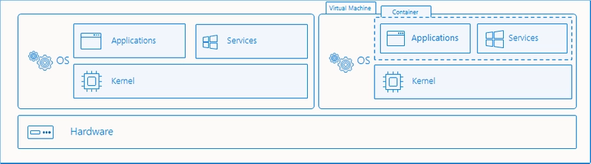

# Windows 컨테이너 기술 살펴보기

## 컨테이너 런타임 이해하기

Windows 컨테이너는 컨테이너 런타임을 출시 시기 별로 세대로 구분 지을 필요가 있습니다. 편의 상, Moby 기반을 1세대, ContainerD 기반을 2세대로 칭하고자 합니다.

### Windows 컨테이너 런타임의 선택

시중에 언급되는 Windows 컨테이너 기술은 대부분 1세대 런타임을 사용하는 것을 전제로 이야기하는 경우가 많습니다.

- 데스크톱 (Windows 11 이상 권장)
  - 소프트웨어 엔지니어, 개발자들이 서버에서 실행할 컨테이너를 빌드하기 위해 컨테이너 런타임을 설치하고 사용할 수 있습니다.
    - Docker Desktop for Windows: Moby 기반의 1세대 런타임으로, 상용 버전으로 구매 후 사용 가능합니다. [^1]
    - 2세대 런타임을 사용하여 컨테이너를 빌드할 수 있는 편리한 제품은 아직 출시되지 않았습니다.
- 서버 (Windows Server 2022 이상 권장)
  - containerd: 2세대 런타임으로, 무료로 설치하여 사용할 수 있습니다. Kubernetes 워커 노드로 참여할 떄에도 이 런타임을 사용합니다.
  - Docker CE / Moby: Moby 기반의 1세대 런타임으로, 무료로 설치하여 사용할 수 있습니다. [^2]
- 컨테이너 오케스트레이션
  - Kubernetes를 기반으로 Windows 워커 노드를 구축하여 사용하는 것이 사실 상의 표준이자 권장안입니다. 단, 마스터 노드는 리눅스 서버로 구축해야 합니다.
  - 주요 3대 관리형 K8s 클러스터 (AWS EKS, Azure AKS, Google Cloud GKE)에서 Windows 워커 노드를 사용할 수 있습니다.

## Windows 컨테이너 빌드

### 일반적인 경우

Windows 컨테이너는 대부분 Moby 기반의 Docker Engine을 이용하여 빌드하는 경우가 많습니다.

1세대 런타임을 이용해서 컨테이너를 빌드할 경우 일부 최신 컨테이너 기능 (예: 폴더 마운트가 아닌 파일 마운트)을 사용하지 못할 수 있습니다.

또한 컨테이너를 이용하여 호스트 시스템을 변경하는 권한 상승 컨테이너 역시 1세대 런타임에서는 지원되지 않습니다. 

이 때문에 Kubernetes 워커 노드 구축 시에는 선언적인 방식으로 설치를 마무리하기 위해 자율적으로 CNI 플러그인 배포나 HNS 변경 등이 필요하기 때문에 2세대 런타임인 containerd를 사용합니다.

### buildkit과 관련된 현황

Moby가 아닌 containerd (2세대) 기반의 컨테이너를 빌드하려면 buildkit을 이용하여 Windows 컨테이너를 빌드하기 위해서는 반드시 buildkitd가 Windows 플랫폼을 지원해야만 합니다.

그러나 이 부분이 아직 개발 단계에 있으며, buildkit 컨트리뷰터와 Microsoft가 공동으로 개발 중이며, 곧 정식 출시될 예정입니다. [^3]

## Windows 컨테이너 CI/CD

### GitHub, GitLab, AppVeyor 등의 빌드 에이전트 사용

- AppVeyor를 제외한 GitHub, GitLab의 Windows Runner VM들의 경우 Windows용 Docker CLI가 제공되지 않거나, 지원에 소극적인 경우가 많습니다.
  - 각 OSS 리포지터리 별로 제공하는 커스텀 빌드 에이전트를 사용하여 CI/CD 빌드 서버를 개별적으로 구축 운영하는 것이 안정적입니다.
  - 또는 AppVeyor의 빌드 머신을 사용하는 것을 추천합니다.
- Windows 컨테이너 이미지 역시 OCI 스펙에 맞추어 개발되었으므로, 일반적인 컨테이너 레지스트리 어디서나 푸시/풀이 가능합니다. [^4]

## 격리 모드

컨테이너 실행 시 격리 모드라는 설정이 존재합니다.

### 프로세스 격리

- 리눅스처럼 커널 자원을 네임스페이스 단위로 분리해서 실행하는 모드입니다. (일반적으로 이야기하는 컨테이너 정의에 부합하는 격리 방식)
- 차지하는 자원이 적고, 컨테이너 호스트에서 작업 관리자 등의 프로그램으로 투명하게 실행 상황 확인이 가능합니다.
- 호스트 OS와 커널 코드를 공유하며, 컨테이너 이미지 안의 커널은 사용하지 않습니다.

### Hyper-V 격리

- CPU 가상화 기술을 이용하여 Windows 컨테이너만 실행하는 소형 VM 안에서 실행하는 모드입니다.
  - 단, Hyper-V라는 기술 스택을 공유할 뿐, 실제 Hyper-V 관리 도구에서 컨테이너를 관리하거나, 반대로 컨테이너 관리 도구 (예: `docker.exe`)가 Hyper-V VM을 관리할 수는 없습니다.
- AWS의 경우 베어메탈 인스턴스, Azure의 경우 3세대 이후 중첩 가상화 지원 인스턴스에서만 실행 가능한 격리 모드입니다.
  - 대개 퍼블릭 클라우드는 인스턴스 자체를 가상 머신을 이용하여 구동하기 때문에, 이 격리 모드를 사용하려면 가상 머신 안에서 또 다른 가상 머신을 만들 수 있는 중첩 가상화가 각 호스트 컴퓨터에 기능으로 제공되어야만 합니다.
- 컨테이너 이미지 안의 커널, 시스템 컴포넌트를 전부 사용, 호스트 OS와는 분리된 상태에서 실행됩니다.
- 일반적인 VM과 달리 동적 메모리 관리를 사용하여 컨테이너 앞으로 할당되는 메모리 크기가 자율적으로 조절할 수 있습니다.
  - 이는 WSL v2에서 사용하는 기술과 동일한 기술입니다.
- Windows Server SKU에 따라 이 방식으로 실행 가능한 컨테이너의 수가 달라집니다. 데이터센터 에디션의 경우 시스템 성능이 허락하는 한도 내에서 무제한, 스탠다드 에디션의 경우 최대 2개 컨테이너만 이 방식으로 실행할 수 있습니다.

## 베이스 이미지

- 리눅스와 달리 `SCRATCH` 이미지로부터 빌드할 수 없습니다. 어떤 경우에서든 최소한 다음 중 하나의 이미지를 반드시 베이스 이미지로 사용해야만 합니다.
  - Nano Server: Windows 커널과 몇 몇 핵심적인 구성 요소들만 포함하는 최소 크기의 Windows 서버 운영 체제 이미지입니다. 크기는 100~200MB 내외입니다.
  - Server Core: 일반적으로 사용하는 Windows Server Core 이미지에서 원격 데스크톱, GUI 표현 및 상호 작용 기능을 제외시킨 일반적인 용도로 사용 가능한 Windows 서버 운영 체제 이미지. 크기는 1~2GB 내외입니다.
  - Windows: Server Core 이미지에, Internet Explorer, DirectX 등 Windows 표준 OS 구성에 들어있는 모든 컴포넌트를 포함한 이미지입니다. 역시 원격 데스크톱, GUI 상호 작용 기능은 제공되지 않으며, 다만 메모리 상에 가상의 화면 영역을 만들어 메시지 루프를 사용하는 방식으로 윈도우 애플리케이션 구동은 일부 허용됩니다. 크기는 4GB 정도입니다.
- Windows 베이스 이미지의 특성
  - 모든 Windows OS 컨테이너 베이스 이미지는 Microsoft Artifact Repository (mcr.microsoft.com)에서 받을 수 있습니다.
  - Windows Server 이미지는 리눅스 베이스 이미지들과 동일하게 최초 배포처를 벗어나서 로컬에 OS 전체 이미지를 캐시할 수 있습니다.

## 리눅스 컨테이너와 달리 지원되지 않는 동작

- 도커 컨테이너 내보내기/가져오기 동작이 지원되지 않습니다.
- 컨테이너 런타임에 따라 달라질 수 있으나, 널리 쓰이는 Docker 기반 구현체의 경우 디렉터리 마운트만 가능하고 파일 마운트는 어렵습니다.

---

[^1]: Microsoft가 Windows Server 라이선싱 비용 안에 포함시켜 제공하던 Docker EE를 Docker Enterprise 부문의 Mirantis 매각 이후, Windows Server용 Docker EE도 같이 이전하여 Mirantis Container Runtime이라는 이름으로 새로운 제품을 출시했습니다. 이 제품 역시 1세대 런타임으로 분류됩니다.

[^2]: 마이크로소프트는 Moby (Docker의 OSS 버전), containerd 런타임을 직접 설치해서 사용할 수 있도록 파워셸 스크립트를 공개적으로 제공합니다. 그러나 사용 방법이 복잡하기 때문에 일반적으로 채택하기에는 적절하지 않습니다.

[^3]: buildkit 0.13 버전부터 Windows용 buildkitd 베타 버전이 처음 출시되었으며, 2024년 중에 안정화될 것으로 예상됩니다. [릴리즈 노트 참고](https://github.com/moby/buildkit/blob/v0.13.0/docs/windows.md)

[^4]: 출시 초기부터 2023년 6월까지는 반드시 mcr.microsoft.com 에서 매번 베이스 이미지를 다운로드 받아야 하도록 베이스 이미지 레이어들은 Foreign Layer로 마킹되어 정책이 강제되었습니다. 그러나 2023년 6월 이후부터 Foreign Layer 마킹이 해제되어, 처음 이미지를 받는 경우를 제외하고, 모든 베이스 이미지를 로컬 레지스트리에 베이스 이미지를 옮겨담는 것이 가능해졌습니다. 이에 따라 Azure가 아닌 다른 데이터센터에서 이미지를 받을 때마다 발생하는 외부 네트워크 통신 비용을 절감할 수 있게 되었습니다. [관련 발표문 참고](https://techcommunity.microsoft.com/t5/containers/announcing-removal-of-foreign-layers-from-windows-container/ba-p/3846833)
